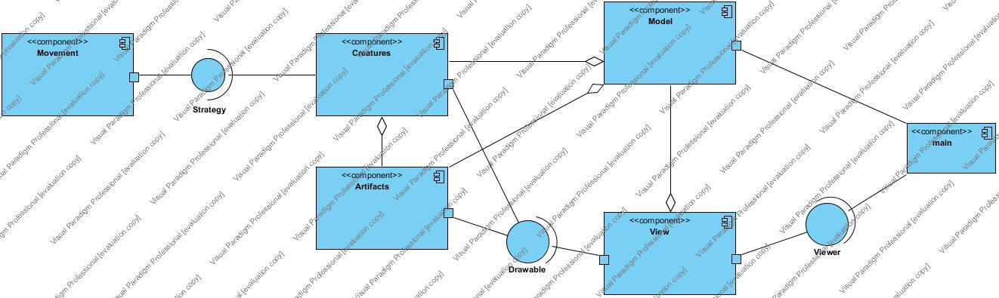
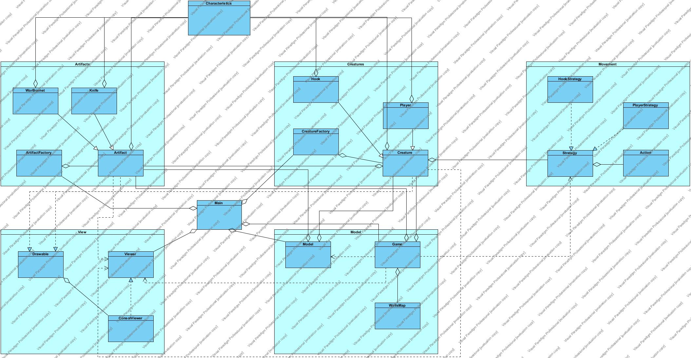

# Roguelike
Сразись с Капитаном Крюком!

## Управление
* **w** &ndash; вверх
* **s** &ndash; вниз
* **a** &ndash; влево
* **d** &ndash; вправо
* **e** &ndash; использовать артефакт
* **q** &ndash; перестать использовать артефакт

## Артефакты
* **k aka Knife** &ndash; нож, дает +10 к атаке
* **b aka War Bonnet** &ndash; индейская шапка, +5 к защите

## Персонажи
* **@ aka Player** &ndash; Герой, упраляемый игроком
* **H aka Hook** &ndash; Капитан Крюк, атакует Героя

## Диаграмма компонент

## Диаграмма классов

## Диздок
[Диздок](https://docs.google.com/document/d/1fb4i6n2V8XLFn6NP135BNWhG2quSq_wI5Izv0jy8J0c/edit?usp=sharing)
