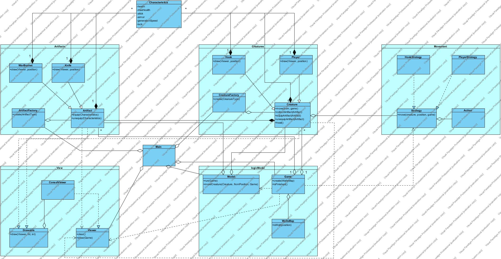

# Roguelike
Сразись с Капитаном Крюком!

## Управление
* **w** &ndash; вверх
* **s** &ndash; вниз
* **a** &ndash; влево
* **d** &ndash; вправо
* **equip 1** &ndash; использовать первый артефакт
* **unequip 2un** &ndash; перестать использовать второй из двух активных артефактов

## Артефакты
* **Knife** &ndash; нож, дает +10 к атаке
* **War Bonnet** &ndash; индейская шапка, +5 к защите

## Диаграмма кмопонент

## Диаграмма классов
